# Αιώνιοι Φοιτητές στο Οικονομικό Πανεπιστήμιο Αθηνών

## ΣΥΝΟΛΙΚΑ
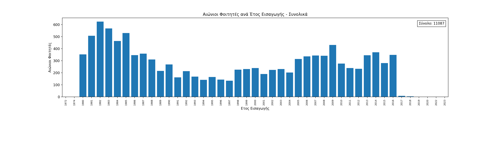
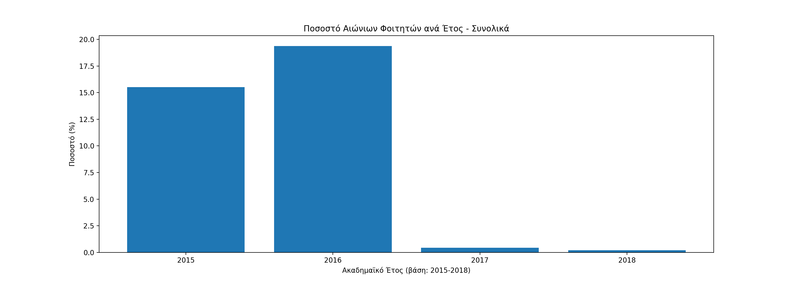

## ΠΛΗΡΟΦΟΡΙΚΗ
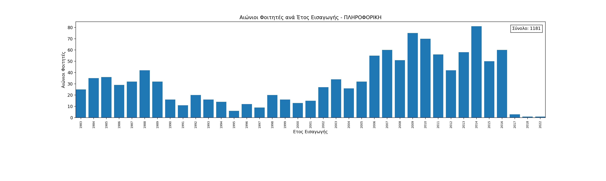
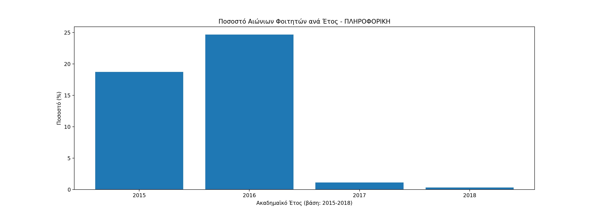

## ΣΤΑΤΙΣΤΙΚΗ
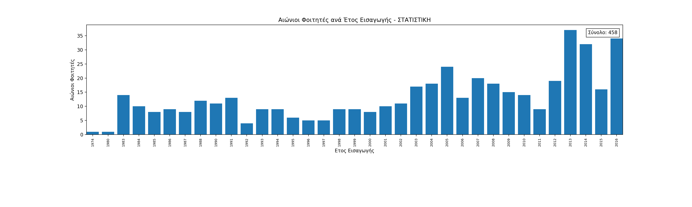
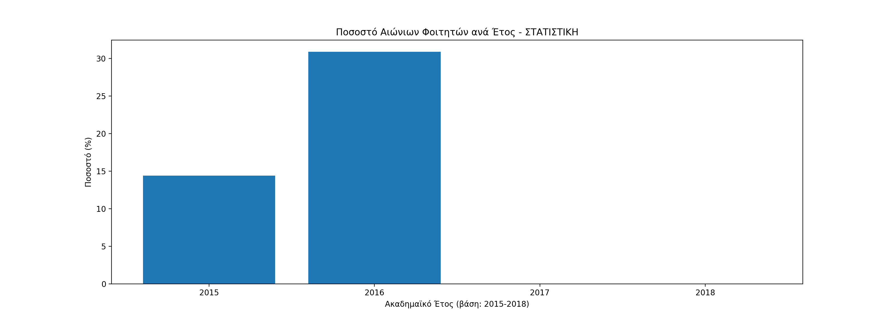

## ΔΕΤ - ΔΙΟΙΚΗΤΙΚΗΣ ΕΠΙΣΤΗΜΗΣ & ΤΕΧΝΟΛΟΓΙΑΣ
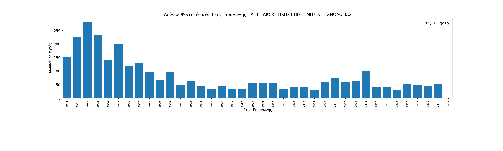
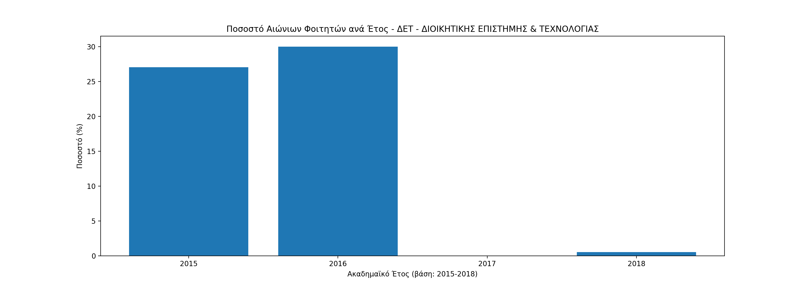

## ΔΕΟΣ - ΔΙΕΘΝΩΝ & ΕΥΡΩΠΑΙΚΩΝ ΟΙΚΟΝΟΜΙΚΩΝ ΣΠΟΥΔΩΝ
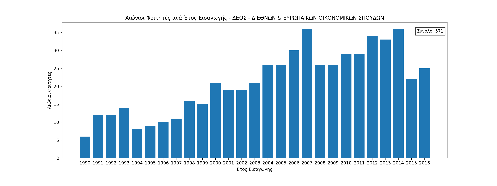
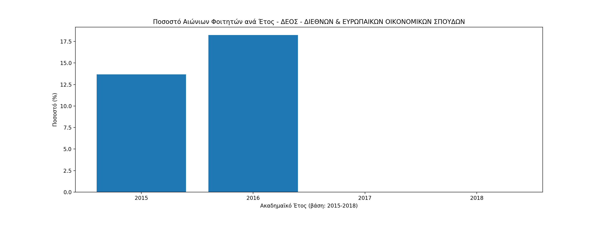

## ΜΑΡΚΕΤΙΝΓΚ
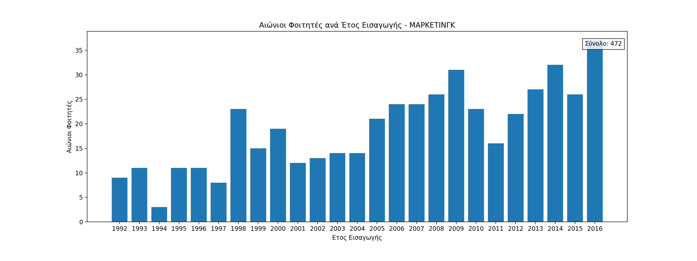
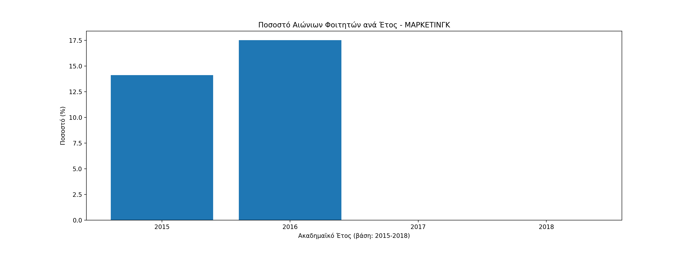

## ΟΔΕ - ΟΡΓΑΝΩΣΗΣ & ΔΙΟΙΚΗΣΗΣ ΕΠΙΧΕΙΡΗΣΕΩΝ 

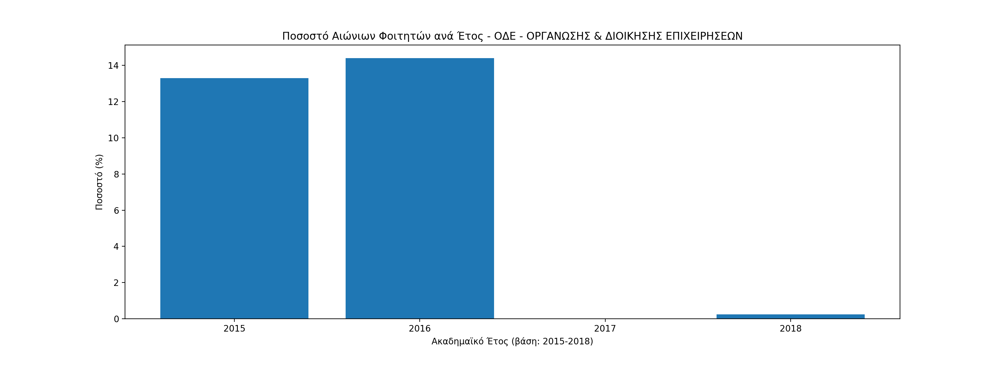

## ΟΙΚΟΝΟΜΙΚΗΣ ΕΠΙΣΤΗΜΗΣ
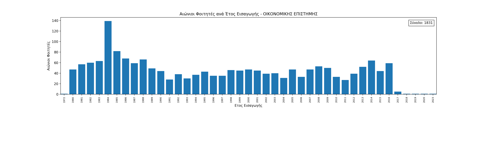
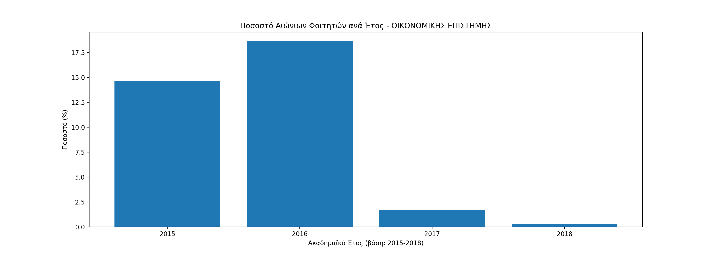

## ΛΟΧΡΗ - ΛΟΓΙΣΤΙΚΗΣ & ΧΡΗΜΑΤΟΟΙΚΟΝΟΜΙΚΗΣ 
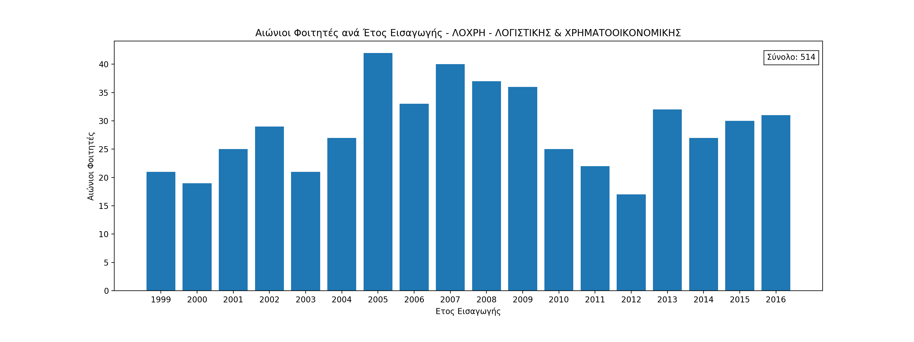
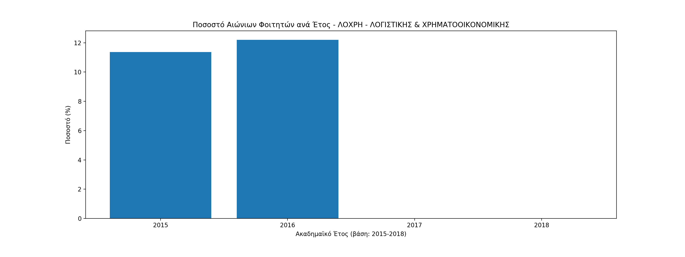

# Πηγές
Ολα τα δεδομένα είναι από την επίσημη σελίδα του Οικονομικού Πανεπιστημίου Αθηνών